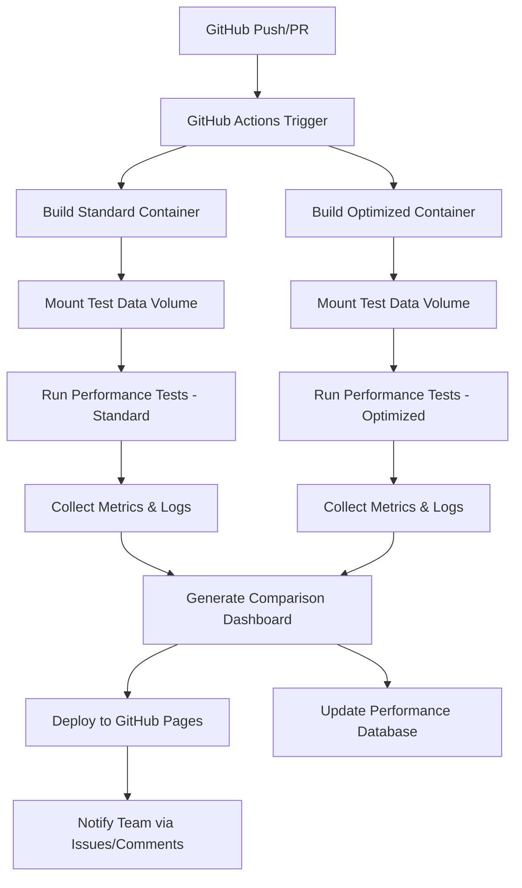

# SuperDARN RST Docker Performance Testing Workflow
# ===============================================

## Overview

This document outlines the automated performance testing workflow for SuperDARN RST that compares optimized vs standard builds using Docker containers, multiple test datasets, and automated dashboard reporting via GitHub Actions.

## Workflow Architecture



## Test Data Structure

The workflow uses standardized test datasets mounted as Docker volumes:

```
test-data/
├── small/           # Quick validation tests (< 1min)
│   ├── radar_001.rawacf
│   ├── radar_002.rawacf
│   └── metadata.json
├── medium/          # Standard performance tests (1-5min)
│   ├── radar_daily_001.rawacf
│   ├── radar_daily_002.rawacf
│   └── metadata.json
├── large/           # Comprehensive tests (5-15min)
│   ├── radar_monthly_001.rawacf
│   ├── radar_monthly_002.rawacf
│   └── metadata.json
└── benchmark/       # Intensive benchmarks (15-30min)
    ├── radar_annual_001.rawacf
    ├── radar_annual_002.rawacf
    └── metadata.json
```

## Performance Test Matrix

| Test Suite | Data Size | Duration | Containers | Metrics Collected |
|------------|-----------|----------|------------|-------------------|
| **Quick Validation** | Small | 1-2 min | Standard + Optimized | Basic timing, memory usage |
| **Standard Performance** | Medium | 3-8 min | Standard + Optimized | Detailed timing, CPU usage, memory peaks |
| **Comprehensive Test** | Large | 10-20 min | Standard + Optimized | Full metrics, thread usage, I/O stats |
| **Benchmark Suite** | Benchmark | 20-45 min | Standard + Optimized | Complete profiling, optimization analysis |

## GitHub Actions Workflow

### Trigger Conditions
- **Push to main branch**: Full test suite
- **Pull request**: Quick validation + standard performance
- **Scheduled (nightly)**: Complete benchmark suite
- **Manual trigger**: Custom test selection

### Workflow Steps

#### 1. Environment Setup
```yaml
- name: Setup Docker Environment
  uses: docker/setup-buildx-action@v2
- name: Cache Docker layers
  uses: actions/cache@v3
  with:
    path: /tmp/.buildx-cache
    key: ${{ runner.os }}-buildx-${{ github.sha }}
```

#### 2. Build Containers
```yaml
- name: Build Standard RST Container
  run: docker build -f dockerfile.optimized --target rst_standard -t rst:standard .
- name: Build Optimized RST Container
  run: docker build -f dockerfile.optimized --target rst_optimized -t rst:optimized .
```

#### 3. Prepare Test Data
```yaml
- name: Download Test Data
  run: |
    mkdir -p test-data
    # Download from secure data repository
    wget -O test-data/small.tar.gz ${{ secrets.TEST_DATA_SMALL_URL }}
    wget -O test-data/medium.tar.gz ${{ secrets.TEST_DATA_MEDIUM_URL }}
    tar -xzf test-data/small.tar.gz -C test-data/
    tar -xzf test-data/medium.tar.gz -C test-data/
```

#### 4. Run Performance Tests
```yaml
- name: Run Standard Performance Tests
  run: |
    docker run --rm \
      -v $(pwd)/test-data:/data \
      -v $(pwd)/results:/results \
      rst:standard /app/run_performance_tests.sh
      
- name: Run Optimized Performance Tests
  run: |
    docker run --rm \
      -v $(pwd)/test-data:/data \
      -v $(pwd)/results:/results \
      rst:optimized /app/run_performance_tests.sh
```

#### 5. Generate Reports
```yaml
- name: Generate Performance Dashboard
  run: |
    python scripts/generate_performance_dashboard.py \
      --standard-results results/standard/ \
      --optimized-results results/optimized/ \
      --output dashboard/
```

## Test Execution Scripts

### Container Test Runner (`run_performance_tests.sh`)
```bash
#!/bin/bash
# Mounted in containers at /app/run_performance_tests.sh

set -e

RESULTS_DIR="/results/$(date +%Y%m%d_%H%M%S)"
mkdir -p "$RESULTS_DIR"

# System info
echo "=== System Information ===" > "$RESULTS_DIR/system_info.txt"
cat /proc/cpuinfo >> "$RESULTS_DIR/system_info.txt"
cat /proc/meminfo >> "$RESULTS_DIR/system_info.txt"

# Test function
run_test_suite() {
    local suite_name=$1
    local data_path=$2
    local output_dir="$RESULTS_DIR/$suite_name"
    
    mkdir -p "$output_dir"
    echo "Running $suite_name test suite..."
    
    # Start system monitoring
    (while true; do
        echo "$(date): $(free -m | grep Mem)" >> "$output_dir/memory.log"
        echo "$(date): $(cat /proc/loadavg)" >> "$output_dir/cpu.log"
        sleep 1
    done) &
    MONITOR_PID=$!
    
    # Run tests with timing
    time_start=$(date +%s.%N)
    
    for rawacf_file in "$data_path"/*.rawacf; do
        if [ -f "$rawacf_file" ]; then
            base_name=$(basename "$rawacf_file" .rawacf)
            echo "Processing $base_name..."
            
            # Run fitacf processing
            /usr/bin/time -v make_fit \
                -i "$rawacf_file" \
                -o "$output_dir/${base_name}.fitacf" \
                2> "$output_dir/${base_name}_timing.txt"
        fi
    done
    
    time_end=$(date +%s.%N)
    kill $MONITOR_PID 2>/dev/null || true
    
    # Calculate total time
    total_time=$(echo "$time_end - $time_start" | bc)
    echo "$total_time" > "$output_dir/total_time.txt"
    
    echo "$suite_name completed in ${total_time}s"
}

# Run test suites based on available data
if [ -d "/data/small" ]; then
    run_test_suite "small" "/data/small"
fi

if [ -d "/data/medium" ]; then
    run_test_suite "medium" "/data/medium"
fi

if [ -d "/data/large" ]; then
    run_test_suite "large" "/data/large"
fi

if [ -d "/data/benchmark" ]; then
    run_test_suite "benchmark" "/data/benchmark"
fi

echo "All tests completed. Results in $RESULTS_DIR"
```

## Metrics Collection

### Performance Metrics Tracked
1. **Timing Metrics**
   - Total processing time per file
   - Per-module execution time
   - Memory allocation time
   - I/O wait time

2. **Resource Usage**
   - Peak memory usage
   - Average CPU utilization
   - Thread count and efficiency
   - Disk I/O statistics

3. **Quality Metrics**
   - Output file sizes
   - Data processing accuracy
   - Error rates and exceptions

4. **Optimization Metrics**
   - Speed improvement percentage
   - Memory usage reduction
   - CPU efficiency gains
   - Thread utilization improvement

### Dashboard Components

#### 1. Executive Summary
- Overall performance improvement
- Key metrics comparison
- Test suite status
- Regression detection

#### 2. Detailed Comparisons
- Side-by-side timing charts
- Memory usage graphs
- CPU utilization plots
- Thread efficiency analysis

#### 3. Historical Trends
- Performance over time
- Optimization effectiveness
- Build quality trends
- Resource usage patterns

#### 4. Test Data Analysis
- Performance by file size
- Processing complexity analysis
- Data type impact assessment
- Scalability metrics

## Dashboard Generation

### Python Dashboard Generator
```python
# scripts/generate_performance_dashboard.py

import json
import plotly.graph_objects as go
import plotly.express as px
from plotly.subplots import make_subplots
import pandas as pd
from pathlib import Path

def generate_dashboard(standard_results, optimized_results, output_dir):
    """Generate comprehensive performance dashboard"""
    
    # Load and process results
    standard_data = load_test_results(standard_results)
    optimized_data = load_test_results(optimized_results)
    
    # Create comparison dataframe
    comparison_df = create_comparison_dataframe(standard_data, optimized_data)
    
    # Generate plots
    plots = {
        'timing_comparison': create_timing_comparison(comparison_df),
        'memory_usage': create_memory_comparison(comparison_df),
        'cpu_utilization': create_cpu_comparison(comparison_df),
        'improvement_summary': create_improvement_summary(comparison_df)
    }
    
    # Generate HTML dashboard
    dashboard_html = create_html_dashboard(plots, comparison_df)
    
    # Save dashboard
    output_path = Path(output_dir) / 'performance_dashboard.html'
    with open(output_path, 'w') as f:
        f.write(dashboard_html)
    
    # Generate JSON summary for GitHub API
    summary = generate_summary_json(comparison_df)
    with open(Path(output_dir) / 'performance_summary.json', 'w') as f:
        json.dump(summary, f, indent=2)
    
    return output_path
```

## Automated Reporting

### GitHub Integration

#### 1. Performance Comments on PRs
```yaml
- name: Comment on PR with Performance Results
  if: github.event_name == 'pull_request'
  uses: actions/github-script@v6
  with:
    script: |
      const fs = require('fs');
      const summary = JSON.parse(fs.readFileSync('dashboard/performance_summary.json'));
      
      const comment = `
      ## 🚀 Performance Test Results
      
      | Metric | Standard | Optimized | Improvement |
      |--------|----------|-----------|-------------|
      | Average Processing Time | ${summary.standard.avg_time}s | ${summary.optimized.avg_time}s | **${summary.improvement.time_percent}%** |
      | Peak Memory Usage | ${summary.standard.peak_memory}MB | ${summary.optimized.peak_memory}MB | **${summary.improvement.memory_percent}%** |
      | CPU Efficiency | ${summary.standard.cpu_efficiency}% | ${summary.optimized.cpu_efficiency}% | **${summary.improvement.cpu_percent}%** |
      
      📊 [View Detailed Dashboard](https://your-org.github.io/rst/performance-dashboard.html)
      
      ${summary.regression_detected ? '⚠️ **Performance regression detected!**' : '✅ No performance regressions'}
      `;
      
      github.rest.issues.createComment({
        issue_number: context.issue.number,
        owner: context.repo.owner,
        repo: context.repo.repo,
        body: comment
      });
```

#### 2. GitHub Pages Deployment
```yaml
- name: Deploy Dashboard to GitHub Pages
  uses: peaceiris/actions-gh-pages@v3
  with:
    github_token: ${{ secrets.GITHUB_TOKEN }}
    publish_dir: ./dashboard
    destination_dir: performance
```

#### 3. Issue Creation for Regressions
```yaml
- name: Create Issue for Performance Regression
  if: contains(steps.check-regression.outputs.result, 'regression')
  uses: actions/github-script@v6
  with:
    script: |
      github.rest.issues.create({
        owner: context.repo.owner,
        repo: context.repo.repo,
        title: '⚠️ Performance Regression Detected',
        body: `Performance regression detected in commit ${context.sha}.\n\nView details: [Performance Dashboard](https://your-org.github.io/rst/performance-dashboard.html)`,
        labels: ['performance', 'regression', 'priority-high']
      });
```

## Configuration Files

### Test Configuration (`test_config.json`)
```json
{
  "test_suites": {
    "quick": {
      "timeout_minutes": 5,
      "data_sets": ["small"],
      "trigger_on": ["pull_request", "push"]
    },
    "standard": {
      "timeout_minutes": 15,
      "data_sets": ["small", "medium"],
      "trigger_on": ["push", "schedule"]
    },
    "comprehensive": {
      "timeout_minutes": 45,
      "data_sets": ["small", "medium", "large"],
      "trigger_on": ["schedule", "manual"]
    },
    "benchmark": {
      "timeout_minutes": 90,
      "data_sets": ["small", "medium", "large", "benchmark"],
      "trigger_on": ["manual", "weekly_schedule"]
    }
  },
  "performance_thresholds": {
    "regression_percent": 5.0,
    "warning_percent": 2.0,
    "max_memory_increase_percent": 10.0,
    "max_time_increase_percent": 5.0
  },
  "dashboard_config": {
    "retention_days": 90,
    "comparison_window_days": 30,
    "auto_cleanup": true
  }
}
```

## Usage Instructions

### Running Tests Locally
```bash
# Quick local test
docker-compose -f docker-compose.optimized.yml up superdarn-performance

# Custom test with specific data
docker run --rm \
  -v /path/to/test-data:/data \
  -v /path/to/results:/results \
  rst:optimized /app/run_performance_tests.sh
```

### Manual GitHub Actions Trigger
```bash
# Trigger specific test suite
gh workflow run performance-testing.yml \
  -f test_suite=comprehensive \
  -f data_sets=small,medium,large
```

### Dashboard Access
- **Latest Results**: https://your-org.github.io/rst/performance-dashboard.html
- **Historical Data**: https://your-org.github.io/rst/performance/history/
- **API Endpoint**: https://api.github.com/repos/your-org/rst/actions/artifacts

## Monitoring and Alerts

### Performance Monitoring
1. **Automated regression detection**
2. **Threshold-based alerting**
3. **Historical trend analysis**
4. **Resource usage monitoring**

### Alert Channels
- GitHub Issues for regressions
- PR comments for performance changes  
- Email notifications for critical issues
- Slack integration for team updates

## Best Practices

### Test Data Management
1. **Version control test datasets**
2. **Use consistent data formats**
3. **Implement data validation**
4. **Regular data updates**

### Performance Baselines
1. **Establish stable baselines**
2. **Regular baseline updates**
3. **Multi-platform testing**
4. **Environment consistency**

### Dashboard Maintenance
1. **Regular cleanup of old results**
2. **Dashboard performance optimization**
3. **User feedback integration**
4. **Feature updates based on needs**

## Troubleshooting

### Common Issues
1. **Container build failures**
2. **Test data access problems**
3. **Dashboard generation errors**
4. **GitHub Actions timeout**

### Debug Commands
```bash
# Check container logs
docker logs <container_id>

# Inspect test results
tree results/ -I '*.log'

# Validate dashboard data
python scripts/validate_dashboard_data.py results/
```

## Future Enhancements

### Planned Features
1. **Multi-architecture testing (ARM64, x86)**
2. **Cloud-based testing infrastructure**
3. **Real-time performance monitoring**
4. **Machine learning-based optimization suggestions**
5. **Integration with external benchmarking tools**

### Scalability Improvements
1. **Parallel test execution**
2. **Distributed testing across runners**
3. **Caching optimization**
4. **Resource pooling**

---

## Quick Start Checklist

- [ ] Set up test data repository
- [ ] Configure GitHub Actions secrets
- [ ] Test Docker container builds
- [ ] Validate dashboard generation
- [ ] Set up GitHub Pages
- [ ] Configure notification channels
- [ ] Run initial performance baseline
- [ ] Document team processes

For detailed implementation, see the GitHub Actions workflow file: `.github/workflows/performance-testing.yml`
